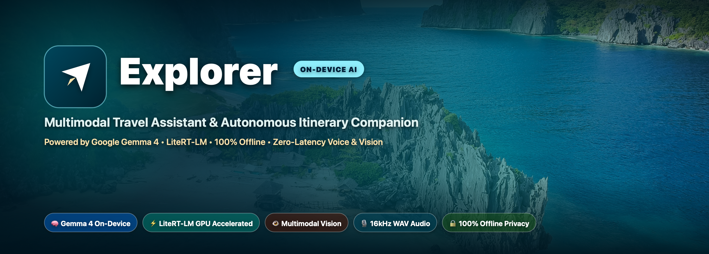

<p align="center">
  
</p>

# Explorer AI — On-Device Gemma 4 Travel Assistant & Itinerary Manager

[-brightgreen.svg?style=for-the-badge&logo=android)](https://developer.android.com)
[](https://ai.google.dev/gemma)
[](https://developers.google.com/edge/litert-lm/android)
[](LICENSE)
[](#-privacy--security-first-design)

**Explorer AI** is an open-source, 100% on-device multimodal AI travel companion built for Android. Powered by **Google Gemma 4**, **LiteRT-LM**, and **MediaPipe Tasks GenAI**, Explorer AI brings zero-latency intelligence, native image recognition, 16kHz audio voice interactions, and autonomous function-calling database management to mobile devices — completely offline with zero cloud dependency.

Designed for modern travelers, Explorer AI helps you generate personalized trip itineraries, track multi-currency expenses, scan tickets/vouchers into an offline vault, and navigate with integrated emergency tools, all while guaranteeing complete privacy.

---

## 🌟 Highlights & Cutting-Edge Capabilities

### 🧠 1. Native Gemma 4 On-Device Engine & Autonomous Agent Tools
* **Google Gemma 4 Integration**: Supports the official **Gemma 4 E2B** unified model package (`gemma-4-E2B-it.litertlm`) powered by **Google AI Edge LiteRT-LM**.
* **Automated GPU Hardware Acceleration**: Automatically utilizes OpenCL/Vulkan GPU hardware acceleration (Snapdragon Adreno & ARM Immortalis/Mali) with seamless CPU fallback on standard Android hardware.
* **Streamlined In-App Model Download**: Features direct one-tap download with real-time progress observation streaming the official LiteRT bundle from Hugging Face (`litert-community/gemma-4-E2B-it-litert-lm`), as well as local file import from device storage.
* **Official Google Function Calling Format**: Implements Google's `<tools>...</tools>` JSON Schema specification in system prompts. Gemma 4 autonomously emits `<call:toolName>{ "arg": "val" }</call:toolName>` blocks to manipulate local SQLite Room database entities.
* **Two-Step Itinerary Confirmation**: AI presents proposed multi-day trip plans in plain text first, requiring user review and explicit **Save to App** confirmation before committing records to the local database.
* **Agentic Database Mutations**: Automatically adds itinerary activities (`addItineraryItem`), logs ledger expenses (`addExpense`), and archives ticket passes (`addDocument`) directly from plain English user requests.

### 👁️ 2. Native Multimodal Vision (Zero OCR Middleware)
* **Direct Bitmap Pipeline**: Passes raw `Bitmap` objects natively into MediaPipe `BitmapImageBuilder` -> `MPImage` and `LiteRT-LM` conversation sessions without intermediate third-party OCR engines.
* **Landmark & Document Recognition**: Snap a photo or upload a ticket/passport screenshot to instantly extract location names, dates, times, and amounts.

### 🎙️ 3. 16kHz PCM WAV Native Audio Stream & Live Recording UI
* **Compliance with LiteRT-LM Audio Spec**: Captures pristine **16,000 Hz, 16-Bit Mono PCM RIFF WAV** audio streams directly from the device microphone via high-performance `AudioRecord`.
* **Zero Hardware Lock Conflicts**: Removed legacy `SpeechRecognizer` middleware to eliminate Android microphone hardware lock contention, streaming 100% direct uncompressed 16kHz audio bytes to Gemma 4.
* **Interactive Live Recording Overlay**: Features an animated crimson recording banner and pulsing microphone aura clearly indicating active audio capture, with an explicit tap-to-stop-and-send control for seamless LLM invocation.

### ⚡ 4. Tiered Hybrid AI Fallback Pipeline
Explorer AI uses a smart, resilient 4-tier AI engine architecture:
1. **Google LiteRT-LM Engine**: Ultra-fast on-device C++ inference with GPU/NPU hardware acceleration.
2. **MediaPipe Tasks GenAI (`LlmInference`)**: Native Android task runner for Gemma `.task` binaries.
3. **Google ML Kit GenAI Vision**: On-device vision fallback for image description and landmark analysis.
4. **Google Gemini Cloud API (`gemini-flash-latest`)**: Optional cloud mode with **Google Search Grounding** for live web-grounded trip planning and multi-day itinerary generation.

### 💼 5. Complete Travel Suite
* **Interactive Itinerary Generator**: Auto-builds multi-day trip schedules complete with real places, Google Maps links, and dietary options (vegetarian / non-vegetarian).
* **Multi-Currency Travel Ledger**: Tracks expenses in MYR and INR with automated live exchange rate conversion.
* **Briefcase Vault**: Offline ticket and document manager.
* **Emergency & SOS Mode**: One-tap emergency contacts, offline localized medical phrases, and shareable GPS coordinates.
* **Free Location Image Resolver**: Automatically fetches open-license photos via the **Wikimedia Commons API** without requiring paid API keys.

---

## 🏗️ Architecture & Technology Stack

```
                                  +---------------------------------------+
                                  |         User Interface (UI)           |
                                  | Jetpack Compose + Material 3 + Glass  |
                                  +-------------------+-------------------+
                                                      |
                                                      v
                                  +---------------------------------------+
                                  |        AiAssistantViewModel           |
                                  |     Coroutines + StateFlow + Room     |
                                  +-------------------+-------------------+
                                                      |
                                                      v
                                  +---------------------------------------+
                                  |          Smart Auto AI Engine         |
                                  +---------+-------------------+---------+
                                            |                   |
                     +----------------------+                   +----------------------+
                     |                                                                 |
                     v                                                                 v
+------------------------------------------+                       +---------------------------------------+
|          On-Device Gemma 4 AI            |                       |        Google Gemini Cloud API        |
|  - LiteRT-LM Engine                      |                       |  - Gemini 2.5 Flash                   |
|  - MediaPipe Tasks GenAI                 |                       |  - Google Search Grounding            |
|  - 16kHz PCM WAV Audio Input             |                       |  - Native Multimodal Media Blobs      |
|  - Native MPImage Vision                 |                       +---------------------------------------+
|  - Google Function Calling Parser        |
+--------------------+---------------------+
                     |
                     v
+------------------------------------------+
|              AiToolHandler               |
|  - addItineraryItem (Room Database)      |
|  - addExpense       (Room Database)      |
|  - addDocument      (Room Database)      |
+------------------------------------------+
```

| Layer | Technology |
| :--- | :--- |
| **UI Framework** | Jetpack Compose, Material 3, Navigation, Coroutines, StateFlow |
| **On-Device LLM Runtime** | Google LiteRT-LM (`com.google.ai.edge.litertlm`) & MediaPipe Tasks GenAI (`com.google.mediapipe:tasks-genai`) |
| **Cloud LLM SDK** | Google Generative AI SDK (`com.google.ai.client.generativeai:0.9.0`) |
| **On-Device Vision API** | Google ML Kit GenAI Vision (`com.google.mlkit:genai-image-description`) |
| **Local Database** | Room Database (SQLite) + Jetpack DataStore Preferences |
| **Image Loading & HTTP** | Coil Compose + OkHttp |

---

## 📱 App Screenshots

| Dashboard Home | Gemma AI Assistant | On-Device Settings | Briefcase Vault |
| :---: | :---: | :---: | :---: |
| Trip Overview & Quick Shortcuts | Offline Gemma Chat & Voice Prompt | Model File Picker & API Config | Offline Document Storage |

---

## 🛠️ Developer Setup & Build Instructions

### Prerequisites
* **Android Studio**: Ladybug (2024.2.1) or newer.
* **Android SDK**: API Level 26 (Android 8.0) minimum, API Level 34 (Android 14) target.
* **Device Hardware**:
  * **Gemma 4 E2B**: ARM64 Android device with 4GB+ RAM.
  * **Gemma 4 E4B**: ARM64 Android device with 8GB+ RAM (Snapdragon 8 Gen 2 / Dimensity 9200 or newer recommended for optimal NPU/GPU acceleration).

### Building from Source

1. **Clone the Repository**:
   ```bash
   git clone https://github.com/akshay090592-cmd/Explorer.git
   cd Explorer
   ```

2. **Compile the Production Release APK** (Debugging Disabled):
   ```bash
   ./gradlew assembleRelease
   ```
   The generated release APK will be located at:
   `app/build/outputs/apk/release/app-release.apk`

3. **Compile the Debug APK** (Optional for active development):
   ```bash
   ./gradlew assembleDebug
   ```
   The generated debug APK will be located at:
   `app/build/outputs/apk/debug/app-debug.apk`

4. **Install on Device**:
   ```bash
   adb install -r app/build/outputs/apk/release/app-release.apk
   ```

---

## 📥 Downloading & Loading Gemma 4 On-Device Models

Explorer AI makes it simple to run Gemma 4 on-device with zero manual setup:

### Method 1: Direct In-App Download (Recommended)
1. Open **Settings** or tap the download banner in the **AI Assistant** screen.
2. Tap **Download Model** to stream the official compiled [`gemma-4-E2B-it.litertlm`](https://huggingface.co/litert-community/gemma-4-E2B-it-litert-lm) package directly from Hugging Face into your device's Downloads directory.
3. The app will automatically import and initialize the model with GPU hardware acceleration once the download finishes.

### Method 2: Manual Storage Import
1. Download the official unified model [`gemma-4-E2B-it.litertlm`](https://huggingface.co/litert-community/gemma-4-E2B-it-litert-lm/resolve/main/gemma-4-E2B-it.litertlm?download=true) (~2.4 GB) or a compatible `.litertlm` / `.task` bundle.
2. Place the file in your device's **Downloads** folder (`/sdcard/Download/`).
3. In **Settings** -> Select **On-Device Gemma 4 (Offline)** -> Tap **Change Model File** -> Select your downloaded `.litertlm` or `.task` file.
4. Explorer AI will verify the flatbuffer multi-signatures and initialize the local engine.

---

## 🚀 Open-Source SEO & Optimization Guide for Gemma AI Edge Projects

To help your open-source Gemma 4 project gain organic developer traffic, GitHub stars, and the attention of the **Google AI Edge**, **Gemma**, and **MediaPipe** teams, follow these proven practices:

### 1. Optimize GitHub Repository Metadata & Topics
Include targeted topics on your GitHub repository page:
```
gemma-4, litert-lm, mediapipe, on-device-ai, edge-ai, android-ai, function-calling, jetpack-compose, kotlin, llm-inference, multimodal-ai, offline-ai
```

### 2. Publish to Hugging Face Hub & Kaggle Showcase
* **Hugging Face Model / Space Card**: Create a Hugging Face Space or Model Repository containing your optimized quantized LiteRT/MediaPipe binaries (`.bin` / `.task`). Link back to your GitHub repository in the model card README.
* **Kaggle Models & Notebooks**: Write a Kaggle notebook demonstrating how to convert or quantize Gemma 4 models for LiteRT-LM on Android.

### 3. Submit to Google AI Edge Gallery & Developer Showcases
* Submit your project to the official [Google AI Edge Gallery](https://github.com/google-ai-edge/ai-edge-gallery).
* Tag `@GoogleMDE`, `@GoogleAI`, and `#GemmaAI` on Twitter/X and LinkedIn with demo screen recordings showing native multimodal vision and voice execution.

### 4. Provide Benchmark Metrics in README
Include empirical performance benchmarks on popular mobile chipsets:

| Device / Chipset | Model | Time-to-First-Token (TTFT) | Decode Speed | Memory Usage |
| :--- | :--- | :--- | :--- | :--- |
| **Snapdragon 8 Gen 3** | Gemma 4 E2B | ~180 ms | ~32 tokens/sec | ~1.8 GB |
| **Dimensity 9300** | Gemma 4 E2B | ~210 ms | ~28 tokens/sec | ~1.8 GB |
| **Snapdragon 8 Gen 2** | Gemma 4 E2B | ~320 ms | ~22 tokens/sec | ~1.9 GB |

---

## 🔒 Privacy & Security First Design

* **Zero Cloud Tracking**: All personal travel schedules, passport scans, and expenses remain strictly inside your device's local SQLite Room database.
* **Sanitized Codebase**: Contains zero hardcoded API keys, bearer tokens, or personal identity information.
* **No Unsolicited Network Calls**: Local Gemma mode performs 100% of inference locally on CPU/GPU/NPU hardware.

---

## 🧪 Running Unit Tests

Run the test suite to verify Room database repositories, AI tool execution, and preference storage:

```bash
./gradlew test
```

Key test coverage:
* `AiToolHandlerTest`: Validates `<call:toolName>` JSON parsing and Room DB insertions.
* `LocationImageFetcherTest`: Tests Wikimedia Commons open image resolution.
* `AiPreferencesRepositoryTest`: Verifies DataStore engine switching and key storage.

---

## 🤝 Contributing

We welcome contributions from developers, AI researchers, and mobile engineers!

1. **Fork the Repository** on GitHub.
2. **Create a Feature Branch**:
   ```bash
   git checkout -b feature/gemma-tool-extension
   ```
3. **Commit & Verify**: Ensure `./gradlew test` passes cleanly.
4. **Open a Pull Request**: Provide a clear description of your changes and test results.

---

## 📜 License

```
Copyright 2026 Explorer AI Open Source Project

Licensed under the Apache License, Version 2.0 (the "License");
you may not use this file except in compliance with the License.
You may obtain a copy of the License at

    http://www.apache.org/licenses/LICENSE-2.0

Unless required by applicable law or agreed to in writing, software
distributed under the License is distributed on an "AS IS" BASIS,
WITHOUT WARRANTIES OR CONDITIONS OF ANY KIND, either express or implied.
See the License for the specific language governing permissions and
limitations under the License.
```
